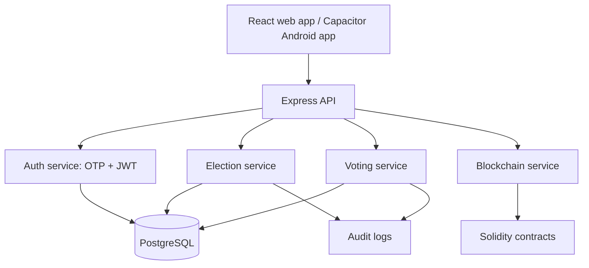

# Janadesh Architecture

Janadesh is a full-stack college voting platform with web, Android, backend, database, and smart-contract components.

## System Overview

## Main Components

### Frontend

The frontend is built with React, Vite, TypeScript, and Material UI. It provides the voter-facing and admin-facing experience: registration, OTP verification, election browsing, candidate review, vote confirmation, and result visibility.

The same web bundle is packaged as an Android app through Capacitor.

### Backend

The backend is an Express and TypeScript API under `/api/v1`. Major route groups include authentication, users, elections, voting, analytics, monitoring, websocket support, and blockchain integration.

The backend uses middleware for CORS, security headers, compression, request logging, parsing, error handling, and rate limiting.

### Database

PostgreSQL stores durable operational data:

- users
- elections
- candidates
- votes cache
- voter registrations
- OTP tokens
- voter eligibility
- audit logs
- refresh tokens
- token blacklist

The schema is migration-driven, which makes setup and reset workflows reproducible.

### Blockchain Module

The Solidity and Hardhat module validates election integrity rules at the smart-contract level, including:

- creator authorization
- candidate registration
- voter registration
- election lifecycle controls
- double-vote prevention
- result visibility after election closure

In the current prototype, blockchain is best described as an integrity validation layer. PostgreSQL remains the primary runtime store.

## Security Model

Janadesh currently targets a controlled institutional election environment.

Implemented or planned security controls include:

- OTP-based identity verification
- JWT access and refresh tokens
- password hashing where password-based flows are used
- rate limiting middleware
- role-aware route protection
- persistent audit logs
- blockchain tests for voting rule integrity
- environment-based secret configuration

Production hardening should add institution SSO or stronger MFA, HTTPS-only deployment, hashed OTP storage, stricter secret rotation, stronger privacy separation between voter identity and ballot choice, and independent audit workflows.

## Data Privacy Notes

For a college deployment, the system should collect only election eligibility data that is required, protect student identity records, expire OTPs, limit administrator access, and define data retention after election closure.

The project should avoid claiming public-election readiness unless it adds formal end-to-end verifiability, coercion-resistance, independent auditability, and production-grade operational security.
