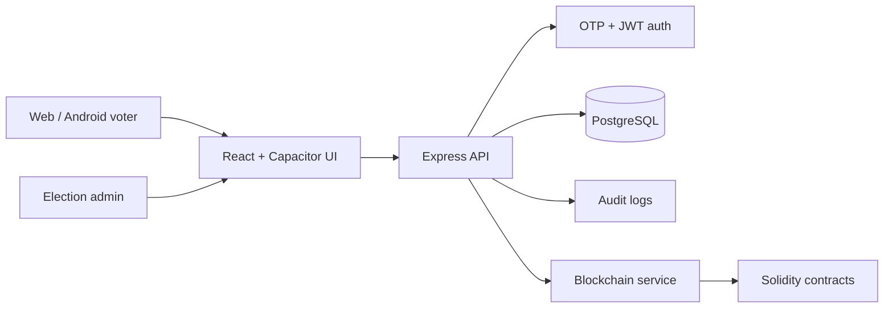

# Janadesh


Secure college voting platform for web and Android.

Janadesh is a full-stack digital voting system built for controlled institutional elections such as student councils, clubs, departments, and campus committees. It supports OTP-based authentication, election and candidate management, vote submission, persistent storage, and smart-contract validation of core voting rules.

> Status: demo-ready academic prototype. Janadesh is suitable for portfolio, viva, and controlled college-election demonstrations. It is not yet production-hardened for public/government election use.

## Highlights

- Email OTP registration and login flow
- Election listing, filtering, candidate details, and vote confirmation
- Admin/creator election lifecycle controls
- PostgreSQL-backed persistence for users, elections, candidates, votes, OTPs, refresh tokens, and audit logs
- Solidity smart contracts for election lifecycle and double-vote prevention rules
- Android app packaging with Capacitor
- Backend, frontend, and blockchain test suites
- Research note and presentation outline included for academic submission

## Tech Stack

| Layer | Tools |
| --- | --- |
| Frontend | React, Vite, TypeScript, Material UI |
| Backend | Node.js, Express, TypeScript |
| Database | PostgreSQL |
| Mobile | Capacitor, Android Studio |
| Blockchain | Solidity, Hardhat, Ethers |
| Tests | Jest, Supertest, Vitest, Testing Library, Hardhat |

## Architecture



See [Docs/ARCHITECTURE.md](Docs/ARCHITECTURE.md) for a fuller architecture and security overview.

## Project Structure

```text
Backend/                 Express API, services, repositories, migrations, tests
Backend/Blockchain/      Solidity contracts, deployment scripts, Hardhat tests
frontend-react/          React web app and Capacitor Android/iOS wrapper
Frontend/                Legacy static frontend snapshot
Docs/                    Supporting docs, architecture notes, and CV checklist
```

## Quick Start

### 1. Backend

```powershell
cd Backend
Copy-Item .env.example .env
npm install
npm run db:init
npm run dev
```

The backend runs on `http://localhost:3001` by default.

### 2. Seed Demo Data

In a second terminal:

```powershell
cd Backend
npm run demo:reset-seed
```

### 3. Frontend

```powershell
cd frontend-react
Copy-Item .env.example .env
npm install
$env:VITE_API_URL="http://localhost:3001/api/v1"
npm run dev -- --host 127.0.0.1 --port 5173
```

Open `http://127.0.0.1:5173`.

### 4. Blockchain Tests

```powershell
cd Backend/Blockchain
npm install
npm run test
```

## Android Development

```powershell
cd frontend-react
$env:VITE_API_URL="http://localhost:3001/api/v1"
npm run mobile:build
npx cap run android
```

For physical-device testing, the Android app must be built with an API URL reachable from the phone. Use a LAN IP or tunnel URL, rebuild, sync, and reinstall the app after changing `VITE_API_URL`.

## Test Commands

```powershell
# Backend
cd Backend
npm run test

# Frontend
cd frontend-react
npm run test:run

# Blockchain
cd Backend/Blockchain
npm run test
```

## Environment Files

Use the example files as templates:

- `Backend/.env.example`
- `frontend-react/.env.example`
- `Backend/Blockchain/.env.example`

Do not commit real `.env` files, SMTP credentials, database passwords, private keys, JWT secrets, or API keys.

## Security Notes

Janadesh demonstrates practical security patterns for an academic voting system:

- OTP-based identity verification
- JWT access and refresh tokens
- rate limiting middleware
- audit-log schema
- role-aware API routes
- smart-contract tests for voting integrity rules

Recommended before real production use:

- replace email OTP with institution SSO, TOTP, passkeys, or stronger MFA,
- hash OTPs before storage,
- use HTTPS-only deployment,
- add stronger privacy separation between voter identity and ballot choice,
- add deterministic end-to-end tests,
- add release-grade Android signing and CI/CD.

## Documentation

- [Project 2 research note](PROJECT_2_JANADESH_RESEARCH.md)
- [Detailed technical report](PROJECT_DETAILED_REPORT.md)
- [Run guide](PROJECT_RUN_GUIDE.md)
- [Presentation outline](PRESENTATION_SLIDES_OUTLINE.md)
- [CV/GitHub checklist](Docs/CV_GITHUB_CHECKLIST.md)

## CV Summary

Built Janadesh, a full-stack secure college voting platform using React, TypeScript, Node.js, Express, PostgreSQL, Capacitor, and Solidity. Implemented OTP-based authentication, election and candidate management, vote submission, audit-friendly persistence, Android packaging, and smart-contract tests for election lifecycle rules including double-vote prevention and result gating.

See [Docs/PORTFOLIO_BRAND_SUMMARY.md](Docs/PORTFOLIO_BRAND_SUMMARY.md) for reusable portfolio, GitHub, app, and CV descriptions.

## License

MIT
